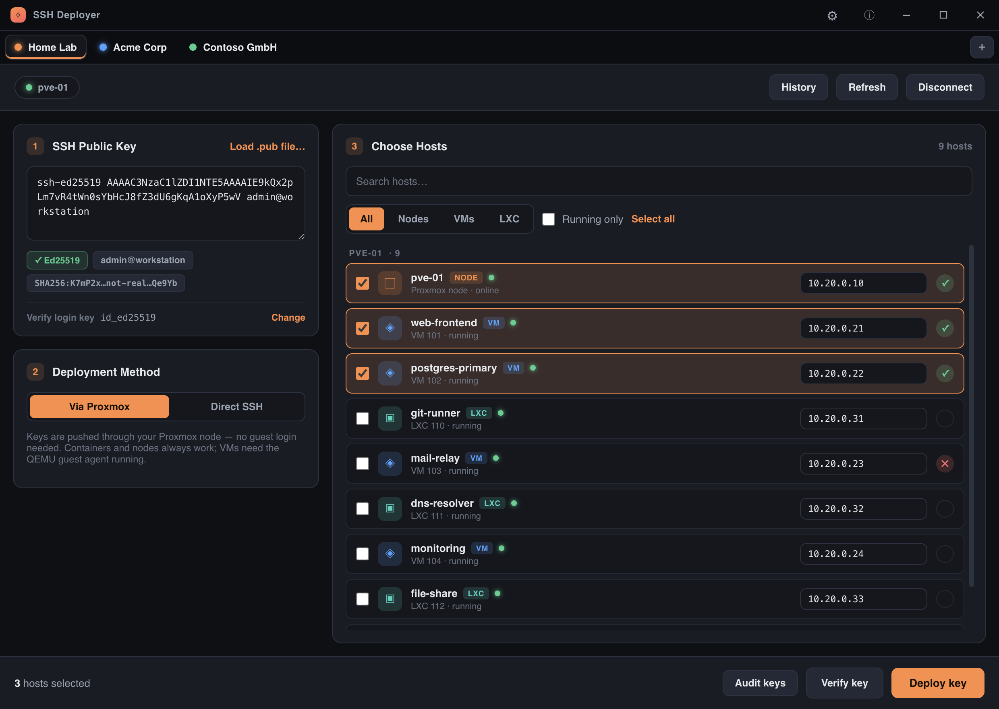

<div align="center">


# SSH Deployer

### Push an SSH public key to every host in your Proxmox cluster — in seconds.

No per‑VM logins. No API tokens. No scripts. Pick your hosts, hit deploy.

<br />


&nbsp;

&nbsp;


<br />

[**⬇  Download**](#-download) &nbsp;·&nbsp; [**Features**](#-features) &nbsp;·&nbsp; [**How it works**](#-how-it-works) &nbsp;·&nbsp; [**Build from source**](#-build-from-source)

<br />



</div>

<br />

---

## The problem

You rotate an SSH key, onboard a teammate, or set up a new laptop — and now you
need that public key on **dozens of VMs and containers** spread across a
Proxmox cluster. Doing it by hand means SSH‑ing into every box and editing
`authorized_keys` one file at a time.

**SSH Deployer** does it for the whole cluster from a single window.

<br />

## ✨ Features

|  |  |
|---|---|
| 🗂️ **Multi‑environment tabs** | Manage your home lab and every client cluster side by side — **drag to reorder**, and switch between them **instantly** as each one stays loaded. |
| 🛰️ **Whole‑cluster inventory** | Connect over SSH to one node and the app reads every **node, VM and LXC container** — no Proxmox API token required. |
| 🚀 **Deploy via Proxmox** | Keys are pushed through the Proxmox node with `pct exec` / `qm guest exec` — **no guest login needed**. Direct‑SSH mode is there as a fallback. |
| ✅ **Key verification** | One click logs into each host with the matching private key and lights it **✓ green / ✕ red / ! amber** — proof the key landed. |
| 🔑 **Audit & remove keys** | See every key already on your hosts — grouped by fingerprint, with the hosts that carry each one — and **remove** a stale key from `authorized_keys` across the cluster. |
| 🩺 **Connection diagnostics** | A failed connection is broken down step by step — DNS, TCP, SSH service, login, Proxmox — so you see exactly what's wrong. |
| 🕓 **Deployment history** | Every deploy is logged: which key, which environment, which hosts, and the result. Searchable. |
| 🔍 **Fast host picker** | Search, filter by type, "running only", multi‑select and batch‑deploy across the whole cluster. |
| ⚙️ **Options** | Launch at login on macOS, Windows and Linux, plus an update check against GitHub releases at startup. |
| 🔒 **Encrypted at rest** | Saved credentials are sealed with the OS keychain via Electron `safeStorage`. |

<br />

## ⬇ Download

Grab the latest build from the **[Releases page](https://github.com/wl-lankin/SSH-Deployer/releases/latest)**.

| Platform | File | Notes |
|---|---|---|
| **Windows** | `SSH Deployer Setup 1.1.0.exe` | Installer. Or `SSH Deployer 1.1.0.exe` for a portable, no‑install build. |
| **macOS** (Apple Silicon) | `SSH Deployer-1.1.0-arm64.dmg` | Open the disk image and drag the app to **Applications**. |
| **Linux** | `SSH Deployer-1.1.0.AppImage` | `chmod +x` it and run — works on any distro, no install needed. |

> **First launch.** The apps are not code‑signed, so the OS may warn you on first run:
> - **Windows** — SmartScreen → *More info* → *Run anyway*.
> - **macOS** — right‑click the app → *Open*, or *System Settings → Privacy & Security → Open Anyway*.

<br />

## 🔧 How it works

```
   ┌───────────────┐   SSH    ┌───────────────┐   pct exec / qm guest exec
   │  SSH Deployer │ ───────▶ │ Proxmox node  │ ───────────────────────────▶  VMs · LXC · nodes
   └───────────────┘          └───────────────┘            authorized_keys
```

1. **Connect** to any one node of your cluster over SSH. The app runs
   `pvesh` to read the full inventory of nodes, VMs and containers.
2. **Paste or load** the public key you want to roll out.
3. **Pick the hosts** — search, filter, select‑all, whatever you need.
4. **Deploy.** In *Via Proxmox* mode the key is appended to each guest's
   `~/.ssh/authorized_keys` through the host — `pct exec` for containers,
   `qm guest exec` for VMs — so you never type a guest password.
   Guests on other cluster nodes are reached automatically.
5. **Verify.** One click confirms the key works on each host.

<br />

## 🖥 Build from source

Requires [Node.js](https://nodejs.org) 18+.

```bash
git clone https://github.com/wl-lankin/SSH-Deployer.git
cd ssh-deployer
npm install

npm start            # run in development

npm run dist:win     # build the Windows installer  (run on Windows)
npm run dist:mac     # build the macOS .dmg          (run on macOS)
npm run dist:linux   # build the Linux AppImage      (run on Linux)
```

Installers are written to `dist/`. Build each target on its matching OS (or in
CI) for best results.

<br />

## 🔒 Security

- Deploying only ever **appends** to `authorized_keys`. Removing a key deletes
  **only that one key's line** — nothing else in the file is touched.
- Saved environment credentials are encrypted with the OS keychain
  (`safeStorage`); if encryption is unavailable, nothing secret is persisted.
- All traffic is plain SSH — no key material leaves your machine except the
  public key you choose to deploy.

<br />

## 📦 Tech

Built with [Electron](https://www.electronjs.org/) and
[`ssh2`](https://github.com/mscdex/ssh2). No other runtime dependencies.

## 📄 License

[MIT](LICENSE) © Wolfgang Linz
